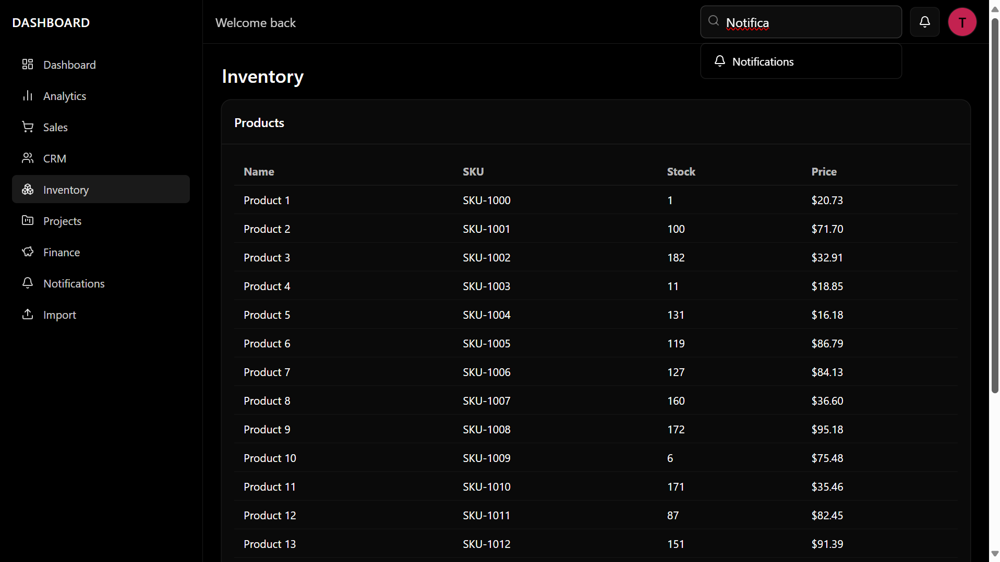

## Wireless Simulate Dashboard

[](https://vercel.com)
[](https://vitejs.dev)
[](https://www.typescriptlang.org)
[](https://www.electronjs.org)
[](#license)

### Overview
Modern, black UI dashboard for wireless simulation data. Built with React, TypeScript, Tailwind CSS, and Vite. Ships as both a static web app (deployable to Vercel) and a Windows desktop app (Electron).

### Features
- **Responsive dashboard**: analytics, CRM, inventory, sales, and more
- **Client-side routing** with `react-router-dom`
- **State management** with `zustand`
- **Forms and validation** using `react-hook-form` and `zod`
- **Charts** powered by `recharts`

### Screenshots
> Replace the image files with your own screenshots to showcase the app.





## Tech Stack
- **UI**: React 19, Tailwind CSS, Lucide icons
- **Bundler**: Vite
- **Language**: TypeScript
- **Routing**: React Router
- **State**: Zustand
- **Desktop**: Electron + electron-builder

## Getting Started

### Prerequisites
- Node.js 18+ (LTS recommended)
- npm (bundled with Node)

### Install
```bash
npm install
```

### Local Development (Web)
```bash
npm run dev
# open http://localhost:5173
```

### Production Build (Web)
```bash
npm run build
# static output in ./dist
```

### Preview Production Build (Web)
```bash
npm run preview
```

## Deploying to Vercel (Web UI)
The project includes `vercel.json` so it deploys as a single-page app (SPA) with proper rewrites.

1. Push the repository to GitHub/GitLab.
2. In Vercel, click “New Project” → import the repository.
3. Use these settings:
   - **Build Command**: `npm run build`
   - **Output Directory**: `dist`
4. Deploy. Client-side routes will be handled by the SPA rewrite to `index.html`.

CLI alternative:
```bash
npm i -g vercel
vercel --prod
```

## Building the Desktop App (Windows)
The app ships as a Windows `.exe` via Electron.

```bash
npm run build:desktop
```

Outputs:
- Unpacked app: `release/win-unpacked`
- Installer: `release/*.exe`

Icon requirement:
- Ensure `public/logo.ico` is a valid `.ico` (not just a renamed `.png`/`.svg`).
- `electron-builder.yml` should reference the icon under the `win.icon` field if customized.

## Configuration Notes

### Vite base path
`vite.config.ts` uses a conditional base path:
- **Web (default)**: `base: "/"`
- **Desktop**: set `BUILD_TARGET=desktop` → `base: "./"`

Desktop scripts already set this env var:
```json
{
  "scripts": {
    "dev:desktop": "cross-env BUILD_TARGET=desktop npm run build && tsc -p desktop/tsconfig.json && node scripts/cjsify-electron.mjs && electron .",
    "build:desktop": "cross-env BUILD_TARGET=desktop vite build && tsc -p desktop/tsconfig.json && node scripts/cjsify-electron.mjs && electron-builder -c electron-builder.yml"
  }
}
```

### SPA Routing on Vercel
`vercel.json` routes all paths to `index.html` so deep links and refreshes work:
```json
{
  "buildCommand": "npm run build",
  "outputDirectory": "dist",
  "framework": "vite",
  "rewrites": [{ "source": "/(.*)", "destination": "/index.html" }]
}
```

## Project Structure
```text
.
├─ desktop/                 # Electron main & preload
├─ public/                  # Static assets (favicons, screenshots)
├─ src/                     # React app
│  ├─ pages/                # Route views (dashboard, analytics, etc.)
│  ├─ components/           # Reusable UI components
│  ├─ layout/               # App shell (sidebar/topbar)
│  ├─ routes/               # Routing utilities
│  └─ store/                # Zustand stores
├─ index.html               # Vite entry
├─ vite.config.ts           # Build config (desktop/web base)
├─ vercel.json              # SPA rewrites for Vercel
└─ electron-builder.yml     # Packaging config
```

## Contributing
Pull requests are welcome. For major changes, open an issue first to discuss what you would like to change.

## License
MIT License. See the [LICENSE](LICENSE) file if present. Otherwise, the license is specified in `package.json`.

## Rights & Attribution
- Copyright © The project author(s).
- Third-party libraries retain their respective licenses.
- Logos and brand names are property of their respective owners.

# medc-0